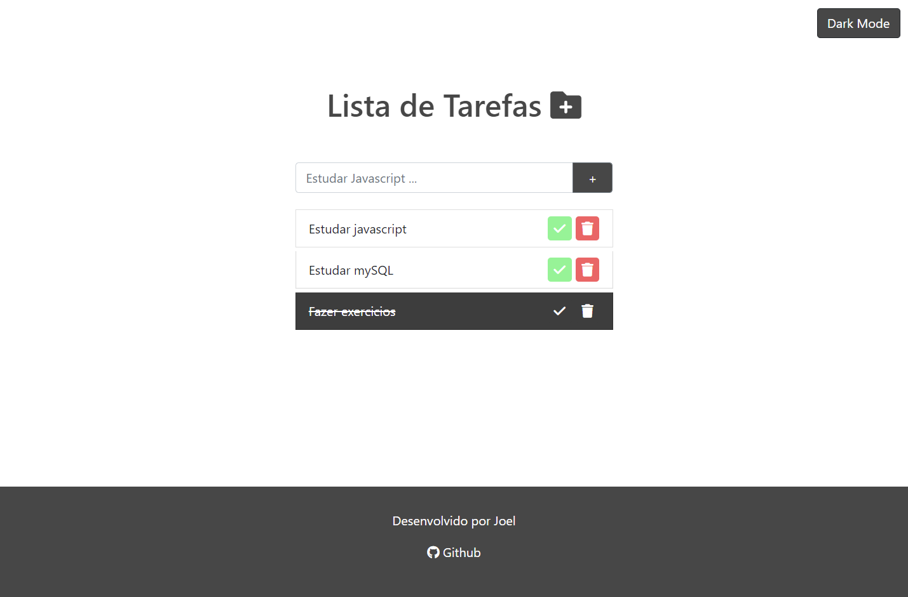
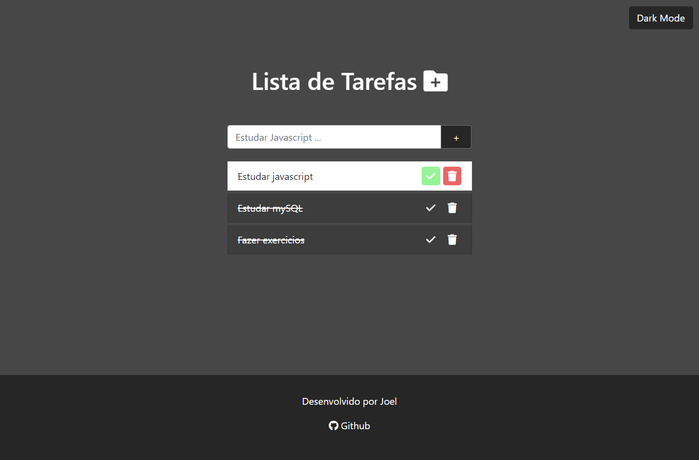

# Lista de tarefas 📇

Uma lista de tarefas feita em **Javascript**, a famosa **to-do list**, quando comecei a estudar **javascript**, ela era um dos meus principais objetivos iniciais de se conseguir fazer.
 

Essa foi a primeira que eu fiz sem pesquisar sobre nada, apenas com o meu conhecimento adquirido até agora, não sei se fiz exatamente do jeito certo mas ela está funcionando.
 

Nesse mini projeto foi usado **HTML, CSS, Javascript e Bootstrap**, aproveitei pra treinar um pouco bootstrap também, alem dela estar **responsiva** e com opção de **Dark mode**.
 
 

 

Linkedin: [Linkedin](https://www.linkedin.com/in/joelpjs/)